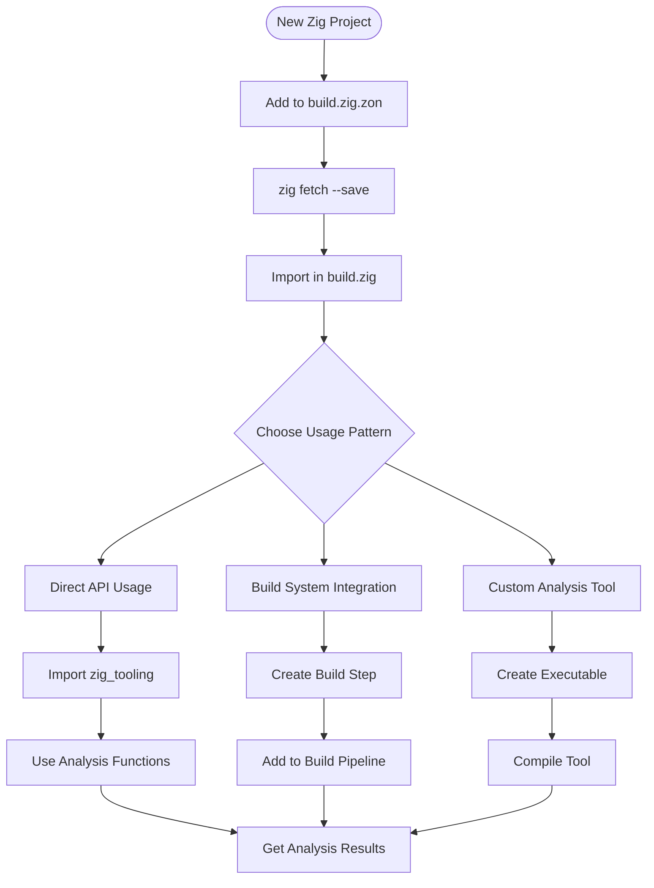
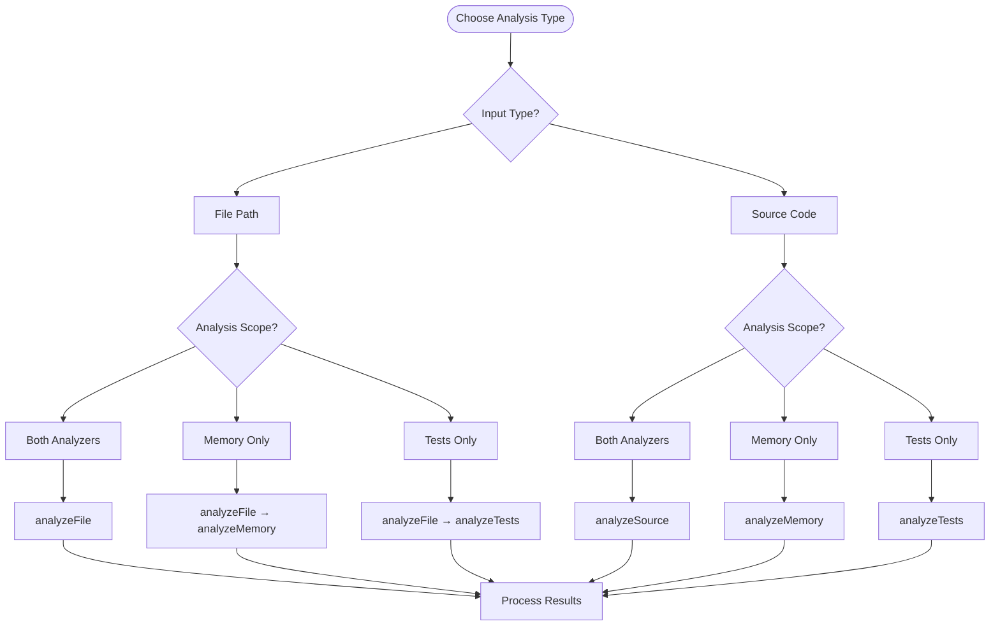
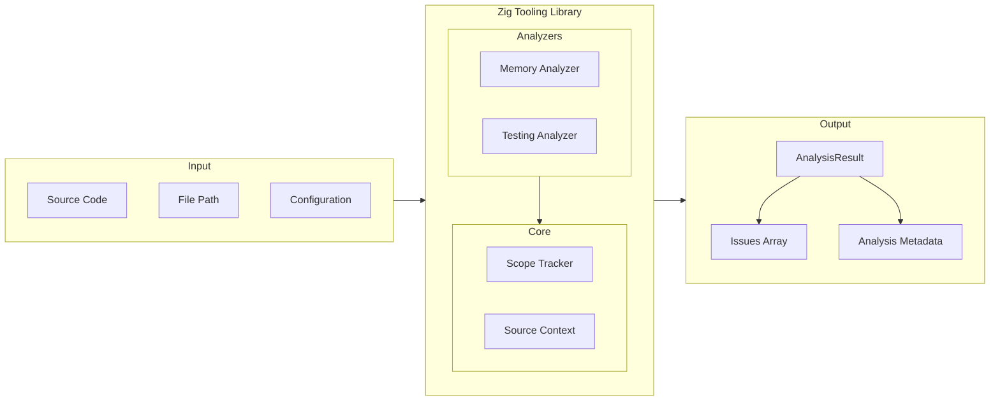
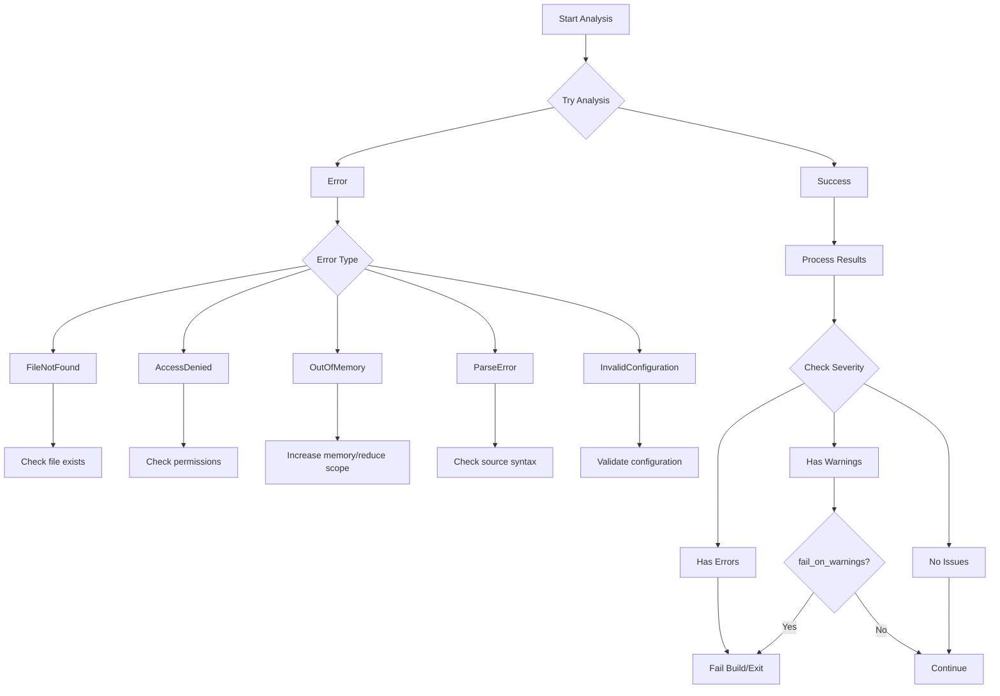
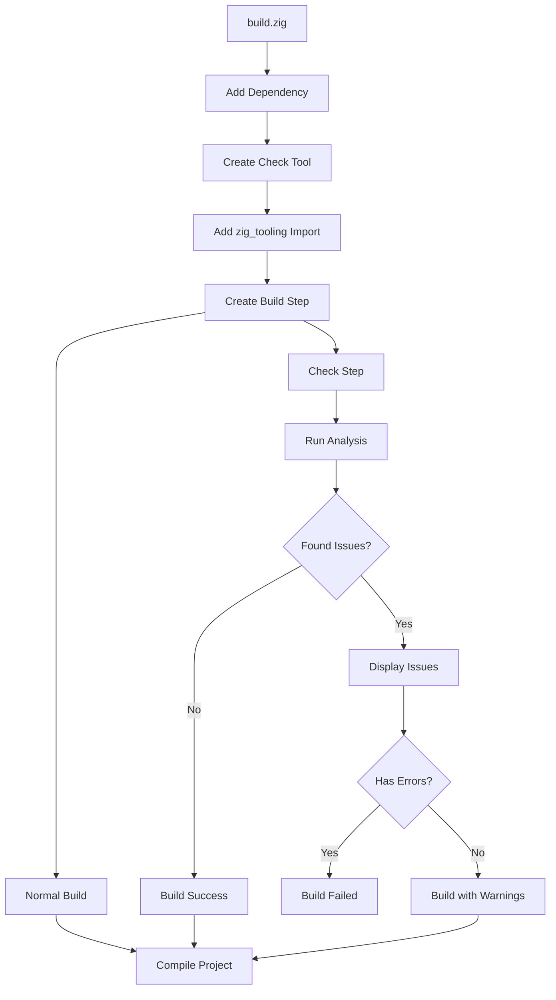
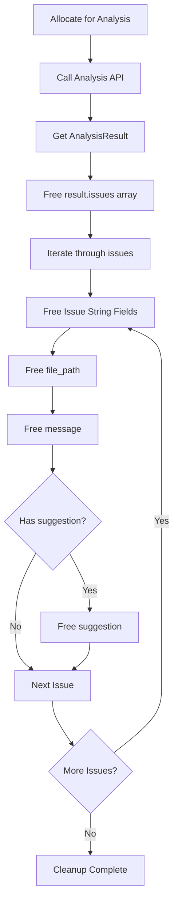
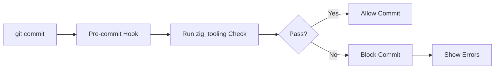
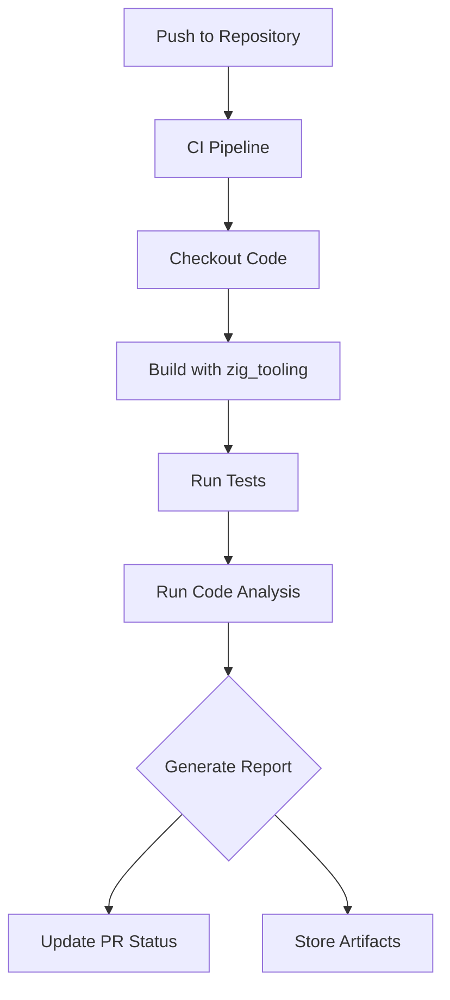
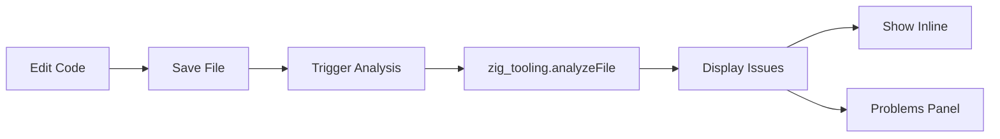

# Zig Tooling Library Usage Flow

This document provides visual flow charts showing how to integrate and use the Zig Tooling library in your projects.

## Integration Flow



## Analysis Type Selection



## Data Flow



## Configuration Options

```mermaid
flowchart TD
    Config[Config Structure] --> Memory[Memory Config]
    Config --> Testing[Testing Config]
    Config --> Patterns[Pattern Config]
    Config --> Options[Analysis Options]
    
    Memory --> check_defer[check_defer: bool]
    Memory --> check_arena[check_arena_usage: bool]
    Memory --> check_allocator[check_allocator_usage: bool]
    Memory --> check_ownership[check_ownership_transfer: bool]
    Memory --> allowed_alloc[allowed_allocators: []const u8]
    
    Testing --> enforce_cat[enforce_categories: bool]
    Testing --> enforce_name[enforce_naming: bool]
    Testing --> allowed_cat[allowed_categories: []const u8]
    Testing --> test_suffix[test_file_suffix: []const u8]
    
    Patterns --> include[include_patterns: []const u8]
    Patterns --> exclude[exclude_patterns: []const u8]
    
    Options --> max_issues[max_issues: ?u32]
    Options --> fail_warn[fail_on_warnings: bool]
    Options --> verbose[verbose: bool]
```

## Error Handling Flow



## Build Integration Example



## Memory Cleanup Pattern



## Common Integration Patterns

### 1. Pre-commit Hook Pattern


### 2. CI/CD Integration Pattern


### 3. IDE Integration Pattern


## Usage Examples

### Basic File Analysis
```zig
const zig_tooling = @import("zig_tooling");

// Analyze a single file
const result = try zig_tooling.analyzeFile(allocator, "src/main.zig", null);
defer allocator.free(result.issues);
defer for (result.issues) |issue| {
    allocator.free(issue.file_path);
    allocator.free(issue.message);
    if (issue.suggestion) |s| allocator.free(s);
};

if (result.hasErrors()) {
    // Handle errors
}
```

### Custom Configuration
```zig
const config = zig_tooling.Config{
    .memory = .{
        .check_defer = true,
        .check_arena_usage = false, // Disable for this project
    },
    .testing = .{
        .allowed_categories = &.{ "unit", "integration", "benchmark" },
    },
};

const result = try zig_tooling.analyzeFile(allocator, path, config);
```

### Build System Integration
```zig
// In build.zig
const check_step = b.step("check", "Run code quality checks");

// Create a separate executable for checking
const check_exe = b.addExecutable(.{
    .name = "check_code",
    .root_source_file = b.path("tools/check.zig"),
});

// Add the library import
check_exe.root_module.addImport("zig_tooling", zig_tooling.module("zig_tooling"));

const run_check = b.addRunArtifact(check_exe);
check_step.dependOn(&run_check.step);
```